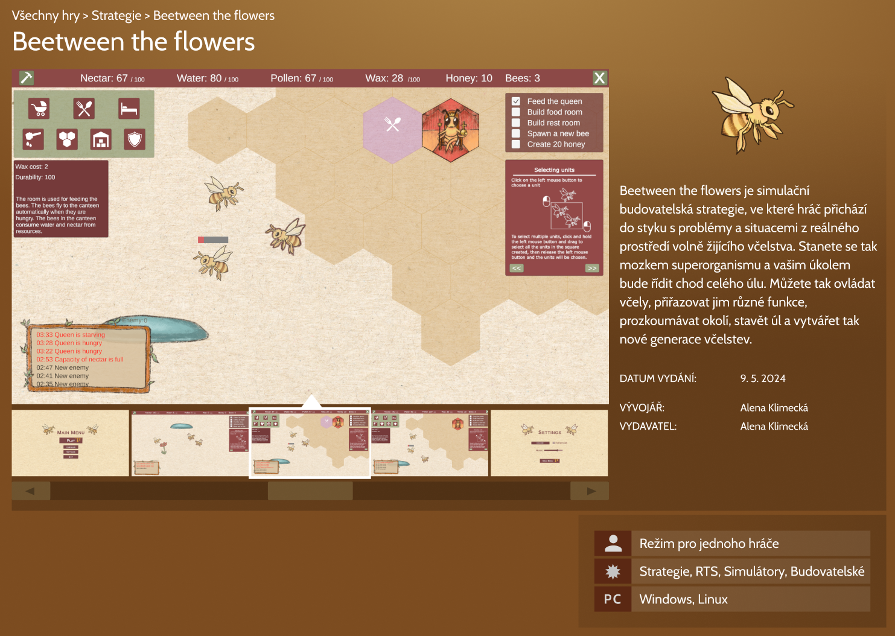

# Beetween the flowers
The aim of this project is to design, implement, and test a game inspired by the life of bees. The design is based on researched data regarding bee biology and reviews of existing games on this topic. 

The game was developed using the Unity engine and coded in C\#. 

It features a tutorial campaign as well as the main gameplay, incorporating mechanics such as unit movement, combat with enemies, building of structures, world generation and exploration. 

The result is a 2D strategy game that not only offers a gaming experience but also educates players about the life of bees.

## Game

## Result 
To play "Beetween the Flowers" online, you can visit: [Beetween the Flowers on itch.io](https://elinkafit.itch.io/beetween-the-flowers)

To see a demonstration video with commentary: [Download the demonstration video](./GamePresentation/game_preview_video_480p.mp4)

To read the bachelor's thesis text: [Link to bachelor's thesis](./BPText/BP_online_version.pdf)

## Created Files - Assets
My scripts can be found in `assets/_scripts_`.  
My artwork is located in `assets/graphics`.

(For more details, the content of the `assets` directory is further described in the `assets` folder.)
